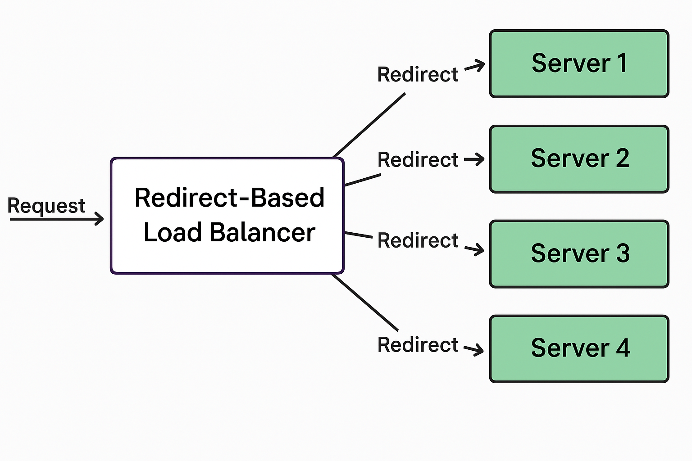

# Random-Redirect-Based Load Balancer

This project demonstrates a simple redirect-based load balancing system using Node.js and Express.



## 📌 Overview

The system consists of:

1. **Random-Redirect-Based Load Balancer**  
   A server running on port `3000` that distributes incoming requests to multiple backend servers using HTTP 302 redirects in a round-robin fashion.

2. **Multiple Backend Servers**  
   Five individual Express servers running on ports `3001` to `300N`, each returning a simple message.

## 📁 Project Structure

```
.
├── redirectBalancer.js   # Load balancer server
├── multiServer.js        # Script to launch multiple backend servers
└── README.md             # Project description
```

## 🚀 How It Works

- Requests to `http://localhost:3000` are redirected (HTTP 302) to one of the backend servers (e.g., `http://localhost:3001`, `http://localhost:3002`, ...).
- The target server responds with a message like:  
  `"Hello from Server 3"`

## 🛠 Technologies Used

- Node.js
- Express.js
- HTTP Module

## 📦 How to Run

1. **Start the backend servers:**

   ```bash
   node multiServer.js
   ```

2. **Start the load balancer:**

   ```bash
   node redirectBalancer.js
   ```

3. **Send a request to:**

   ```
   http://localhost:3000
   ```

   You will be redirected to one of the backend servers.

## 📌 Notes

- This is a demo implementation and not suitable for production environments.
- For real-world applications, consider using reverse proxy-based load balancers (e.g., Nginx, HAProxy).
